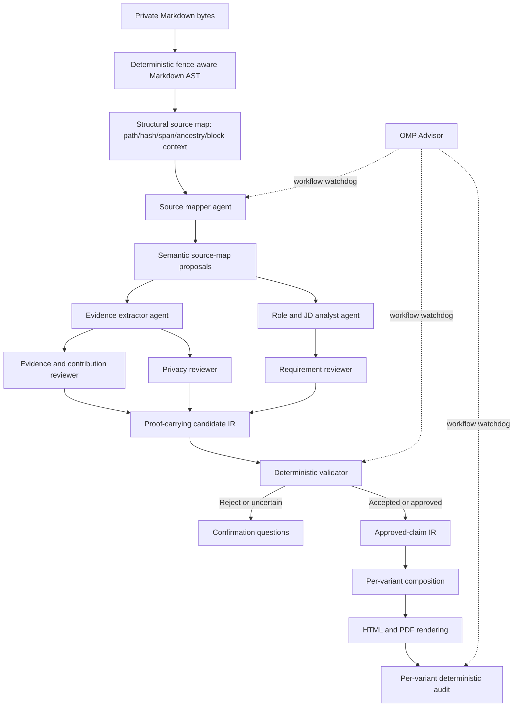

# OMP Plugin Migration Plan

## Purpose

This document is the handoff plan for evolving `china-targeted-resume` from a repository-format-specific OMP Skill plus Python CLI into an OMP Plugin that can understand heterogeneous Markdown through controlled agent reasoning while preserving deterministic evidence, privacy, provenance, rendering, and output guarantees.

The target is not a natural-language-only resume generator and not a mechanical Python-to-TypeScript rewrite. The target is:

> An OMP Plugin that bundles a Skill and specialized agents, uses agents to propose and independently review semantic mappings, and uses a deterministic kernel to verify source identity and lock approved claims into final artifacts.

The migration has exactly three phases:

1. Secure heterogeneous ingestion and proof-carrying IR.
2. OMP Plugin orchestration with specialized agents.
3. Incremental TypeScript parity and kernel consolidation.

Do not begin a later phase before the preceding phase exit criteria pass.

## Current baseline and concurrent-work warning

This plan was written on 2026-08-21 against `main` with OMP `17.3.7`.

At authoring time, another session had uncommitted work in the repository. That work introduces multiple resume variants and changes core contracts:

- default recruiter one-page and technical two-page variants;
- an opt-in extended three-page profile;
- `include_extended_profile` replacing the caller-selected `target_pages` request field;
- `ResumeVariant` and per-variant composition rules;
- `resume-variants.json` as the artifact discovery manifest;
- per-variant document, provenance, validation, audit, Markdown, ATS, HTML, PDF, and preview artifacts;
- JSON Schema validation through the new `jsonschema` dependency.
- a changed request/document shape that still reports `schema_version: 1`, requiring an explicit clean-cutover or schema-version decision before freezing the Phase 1 IR.

The concurrent session currently touches these tracked files:

```text
README.md
README.zh_CN.md
SKILL.md
assets/styles/base.css
assets/templates/ats-simple.html.j2
pyproject.toml
references/output-contract.md
schemas/request.schema.json
schemas/resume-document.schema.json
scripts/render_pdf.py
src/china_targeted_resume/adapters/markdown_career_v1.py
src/china_targeted_resume/audit.py
src/china_targeted_resume/cli.py
src/china_targeted_resume/composition.py
src/china_targeted_resume/models.py
src/china_targeted_resume/pipeline.py
src/china_targeted_resume/rendering/inspect.py
src/china_targeted_resume/rendering/pdf.py
tests/test_adapter.py
tests/test_cli.py
tests/test_composition.py
tests/test_end_to_end.py
tests/test_rendering.py
uv.lock
```

It also has these untracked files:

```text
schemas/resume-variants.schema.json
tests/test_resume_variants_schema.py
```

This document is the only file this planning session should add. Do not reset, stash, revert, reformat, stage, or overwrite the concurrent session's files.

### Required re-baseline at the start of the next session

Before implementing Phase 1:

```bash
git status --short --branch
git log -5 --oneline
git diff --stat
omp --version
```

Then:

1. Determine whether the resume-variant work has been committed and merged.
2. Treat the committed variant contracts as the new baseline; do not reintroduce `target_pages` as a user request field.
3. Ensure all new IR and Plugin outputs reference `resume-variants.json` rather than assuming one canonical `resume-document.json` or `resume.pdf`.
4. Decide whether the changed request/document contracts remain a clean `schema_version: 1` cutover or require a schema-version increment; do not use the unchanged version field to infer the shape.
5. Run the current suite before migration work:

   ```bash
   uv sync
   uv run pytest -q
   uv build
   uv run python scripts/package_skill.py
   ```

6. If the concurrent work is still uncommitted, coordinate ownership before editing any overlapping file. Phase 1 necessarily overlaps the adapter, models, pipeline, schemas, and tests, so it must not start on an unstable working tree.

## Confirmed problem statement

### Internal Markdown structure is the primary compatibility risk

`markdown-career-v1` does more than discover directories. It interprets Markdown using format-specific heuristics:

- ATX headings rather than a full semantic document tree;
- GFM pipe tables and fixed column/label expectations;
- bullet-label profile fields and fixed Chinese/English labels;
- timeline tables with expected headers and record-type values;
- public-link tables with expected labels and status wording;
- semantic gates based on selected heading names;
- JD requirement classification based on current heading names, bullets, and fixed Required/Preferred/Responsibilities vocabulary;
- application constraints extracted by line-level regular expressions;
- evidence discovery based on lexical overlap, selected heading patterns, and a maintained set of technical anchors.

This behavior is useful for a known source contract but cannot safely claim to understand arbitrary Markdown organization. Additional regular expressions will improve isolated fixtures while increasing hidden coupling and maintenance cost.

### Confirmed current parser defects

Two false-positive evidence paths were reproduced against the current implementation:

1. A child section under an `F6/P3` parent can be admitted as lower-sensitivity evidence when the blocked parent is skipped and the child heading does not carry the ancestor policy marker.
2. A Markdown bullet inside a fenced code block can be admitted as a real evidence candidate because claim-unit extraction is not consistently fence-aware.

These are Phase 1 release blockers for real private data. They demonstrate that structural provenance must include heading ancestry and block context before semantic agents are introduced.

## Architectural decision

### Responsibility split

| Component | Owns | Must not own |
| --- | --- | --- |
| Deterministic Markdown layer | bytes, encoding, AST/tokens, path, hash, exact line/byte spans, heading ancestry, fence/blockquote/table/list context | arbitrary business semantics such as "this means personal ownership" |
| Source mapper agent | document/section semantic proposals, local format vocabulary, candidate owner mapping, uncertainty | final evidence eligibility or irreversible writes |
| Evidence/role agents | candidate extraction, requirement interpretation, semantic claim proposals | path/hash/span truth or final policy approval |
| Independent reviewers | source-to-claim entailment review, contribution/metric review, privacy review | deterministic proof or automatic user consent |
| Advisor | workflow watchdog, missing-step warnings, policy-process reminders | approval, state mutation, or source-truth certification |
| Deterministic validator | path containment, hash/span/quote identity, structural exclusions, effective policy inheritance, schema validity, approved-claim locking, provenance closure | proving that an arbitrary paraphrase did not semantically expand contribution |
| Composition/rendering kernel | exact approved claims to variant documents, HTML/PDF, private output, audit artifacts | discovering new candidate facts |

### Claim modes

The migration must implement two explicit claim modes.

#### Extractive mode: default

Allow only source text or mechanically constrained transformations that preserve:

- actor;
- contribution verb;
- object and system boundary;
- numbers, units, dates, stages, and populations;
- uncertainty and approximation qualifiers;
- personal/team scope;
- privacy level.

The deterministic validator may prove exact source identity and allowed template transformation. It must reject a transformation that is outside the supported mechanical rules rather than attempting general semantic equivalence.

#### Reviewed semantic mode: opt-in per claim

Allow translation, compression, or resume-oriented paraphrase only after:

1. a semantic agent proposes the claim;
2. an independent evidence reviewer checks source support;
3. an independent contribution/metric reviewer checks scope preservation;
4. a privacy reviewer checks disclosure eligibility;
5. the user confirms material ambiguity, P2 use, dynamic facts, or contribution boundaries when required;
6. the resulting `approved_safe_claim` is recorded in the IR.

The deterministic kernel then guarantees only that every final variant uses the exact approved claim and provenance. It must not report that it proved the semantic paraphrase correct.

### Target data flow



## Cross-phase invariants

Every phase must preserve these invariants:

1. The source knowledge base remains read-only.
2. Output remains outside the source root.
3. Generated directories and files remain `0700` and `0600`.
4. Navigation indexes, Plugin telemetry, caches, and Plugin-owned state never persist source bodies, contact details, F6/P3 content, credentials, or prompt transcripts. OMP session persistence is a separate trust boundary: raw source slices are disabled by default and may enter a model/subagent session only through the explicitly authorized reviewed-semantic mode defined in Phase 2.
5. Company research, role research, and roadmap plans never become candidate evidence.
6. Every explicit requirement retains an exact quote and source span.
7. Every visible claim references approved evidence and provenance.
8. No component silently upgrades contribution verbs, metric precision, metric scope, or employment facts.
9. The default mode fails closed: omit or ask rather than infer.
10. Every generated resume variant is independently validated against the authoritative `resume-variants.json` contract.
11. Plugin installation must not imply that the Python CLI is globally installed.
12. No phase deletes a working implementation until its replacement passes contract parity.

# Phase 1: Secure heterogeneous ingestion and proof-carrying IR

## Objective

Stop treating fixed Markdown wording and internal layout as trusted semantics. Build a safe structural ingestion boundary and a schema-backed IR that agents can propose but only deterministic code can bind to source bytes.

Phase 1 remains Python-first. It fixes current correctness defects and creates stable contracts before OMP orchestration or language migration.

## Preconditions

- The concurrent resume-variant work is committed or otherwise assigned to one owner.
- The existing suite, build, and Skill packaging pass from a clean baseline.
- `resume-variants.json` and the new variant artifact names are treated as authoritative if the concurrent feature has landed.

## Workstream 1.1: Replace ad hoc structural parsing

Use `markdown-it-py`, already a runtime dependency, as the structural parser. Preserve token source maps and build an explicit tree rather than flattening headings without ancestry.

The current parsing surface is split between `markdown_career_v1.py` and helper logic in `pipeline.py` for profile fields, timelines, role scope, and related Markdown interpretation. Inventory both before implementation. Route every structural read through one AST/source-span service; leaving a second set of pipeline regular expressions would preserve the same format sensitivity behind a new adapter boundary.

Add internal structural models with at least:

```text
SourceDocument
MarkdownSection
MarkdownBlock
SourceLocation
HeadingAncestor
StructuralFlags
```

Required fields include:

```json
{
  "path": "personal-data/projects/example.md",
  "source_hash": "sha256:...",
  "start_line": 12,
  "end_line": 19,
  "start_byte": 240,
  "end_byte": 588,
  "heading": "What I owned",
  "heading_ancestry": ["Payment Platform", "What I owned"],
  "block_kind": "list_item",
  "inside_fence": false,
  "inside_blockquote": false,
  "inside_html": false
}
```

Implementation rules:

- Decode once and retain the exact source bytes/hash used for spans.
- Exclude fenced content from evidence by default.
- Mark blockquotes, HTML blocks, examples, templates, and quoted material; do not admit them automatically.
- Preserve duplicate-heading identity without relying only on generated anchors.
- Preserve ancestor headings and document-level policy markers.
- Treat malformed Markdown as a validation warning or failure, not as permission to broaden retrieval.
- Remove or migrate duplicate structural parsing in `pipeline.py`; downstream stages must consume the structural IR instead of reopening Markdown with independent regular expressions.

## Workstream 1.2: Fix effective privacy and fact policy

Calculate effective policy from the most restrictive applicable source:

```text
document policy
+ ancestor heading policies
+ current heading policy
+ block-local policy
= effective policy
```

The implementation must:

- propagate `F6/P3` from ancestors to all descendants;
- reject conflicting policy metadata unless an explicit deterministic precedence rule resolves it;
- exclude secret-looking paths and content before any model receives a source slice;
- separate navigation metadata from source bodies;
- record only policy enums and provenance metadata in persistent indexes.

Add regression tests for the two confirmed false-positive paths before changing broader behavior.

## Workstream 1.3: Add structure-perturbation fixtures

Extend synthetic fixtures without using personal data. Cover at least:

- nested headings with ancestor F/P markers;
- fenced Markdown containing headings, tables, and bullets;
- blockquotes containing resume-like claims;
- Setext headings;
- prose-only projects;
- reordered and renamed table columns;
- bullet-label, definition-list-like, and paragraph-based profile fields;
- bilingual and user-defined headings;
- duplicate headings;
- HTML blocks/details;
- examples and negative instructions containing claim-like language;
- requirements expressed without Required/Preferred headings;
- metrics split across adjacent blocks;
- team context followed by a narrower personal-contribution block;
- non-engineering roles and vocabulary.

Tests must assert both recall and rejection. A fixture is insufficient if it only verifies that some candidate was found; it must verify the exact source span, effective policy, and why nearby non-evidence was excluded.

## Workstream 1.4: Define normalized IR schemas

Add strict Draft 2020-12 schemas and matching canonical models for:

```text
schemas/source-map.schema.json
schemas/normalized-role-input.schema.json
schemas/normalized-evidence-input.schema.json
schemas/review-decision.schema.json
schemas/approved-claims.schema.json
```

Minimum IR relationships:

```text
source document
  -> structural section/block
  -> semantic proposal
  -> evidence candidate
  -> reviewer decisions
  -> approved claim
  -> resume variant claim
  -> final provenance
```

A semantic proposal must include:

- source path/hash/span;
- exact verbatim quote;
- proposed domain and owner;
- proposed claim or requirement;
- semantic confidence;
- reasoning basis;
- claim mode;
- unresolved questions.

An approved claim must include:

- immutable `claim_id`;
- originating evidence IDs;
- exact `approved_safe_claim`;
- approval basis (`mechanical`, `independent_review`, or `user_confirmed`);
- reviewer decision IDs;
- preserved contribution and metric qualifiers;
- disclosure decision and audience/purpose when applicable.

Schemas must forbid source bodies outside exact quotes and must reject unknown fields.

## Workstream 1.5: Add deterministic validation commands

Introduce narrow CLI stages rather than another monolithic parser:

```text
discover-source-structure
validate-source-map
validate-role-input
validate-evidence-input
approve-claims
generate-from-ir
```

Exact names may follow existing CLI conventions, but the contracts must remain separate.

The validator must re-open the source and verify:

- canonical path containment;
- no symlink escape;
- source hash;
- exact span bounds;
- exact quote identity;
- block structural flags;
- effective ancestor policy;
- role/company/roadmap domain separation;
- required approval state;
- schema validity;
- final claim text exactly equals the approved IR.

For extractive claims, validate only explicitly supported mechanical transformations. For reviewed semantic claims, validate approval and locking; do not claim semantic proof.

## Phase 1 tests and verification

Required focused verification:

```bash
uv run pytest -q tests/test_adapter.py
uv run pytest -q tests/test_evidence.py tests/test_policy.py tests/test_composition.py
uv run pytest -q tests/test_cli.py tests/test_end_to_end.py
uv run pytest -q
uv build
uv run python scripts/package_skill.py
```

Add a smoke scenario with an intentionally nonstandard synthetic Markdown repository. The scenario must produce a source map, route uncertain semantics to confirmation, reject fenced and inherited-private content, and generate the current default resume variants only from approved claims.

## Phase 1 exit criteria

- Both confirmed false-positive evidence paths have failing-before/passing-after regression tests.
- Structural parsing is fence-aware and preserves heading ancestry.
- The deterministic layer no longer assigns arbitrary business semantics solely from heading keywords.
- Proof-carrying IR schemas are strict and round-trip through canonical models.
- Every accepted candidate can be revalidated from path/hash/span/quote.
- Extractive and reviewed-semantic claim modes are distinguishable in artifacts and audit output.
- Current resume variants and `resume-variants.json` remain valid.
- Full tests, build, Skill package, source immutability, private modes, and real PDF checks pass.

## Phase 1 non-goals

- No OMP Extension yet.
- No full TypeScript rewrite.
- No generic semantic equivalence checker.
- No persistence of source bodies in a vector index or prompt cache.

# Phase 2: OMP Plugin orchestration with specialized agents

## Objective

Make the OMP Plugin the primary interactive product while retaining the deterministic Phase 1 kernel. Bundle the Skill, typed tools, commands, and specialized agent definitions so OMP can perform adaptive semantic discovery and independent review without relaxing evidence or privacy boundaries.

## OMP API constraints to preserve

The plan was validated against OMP `17.3.7`; re-check APIs before implementation.

Current Extension capabilities include typed command/tool registration, events, tool interception, session entries, UI interaction, and session-stop handling. A Plugin package can also distribute Skills, agents, commands, rules, and prompts.

Do not assume the Extension can directly invoke all built-in orchestration:

- no public `spawnTask`/`createSubagent` convenience API was identified;
- no direct `enableAdvisor` or advisor-approval API was identified;
- `ctx.invokeTool` is not a general bridge to arbitrary built-ins;
- an SDK-created agent session does not automatically reproduce the built-in task manager, `agent://` artifacts, idle/revive behavior, spawn policy, approval flow, or MCP proxying.

Therefore, the first Plugin version must let the bundled Skill instruct the main model to use OMP's built-in `task` tool. Do not reimplement the task runtime in Phase 2.

## Workstream 2.1: Create the Plugin package shell

Add a Bun/TypeScript package without removing the Python package:

```text
package.json
bun.lock
tsconfig.json
src/plugin/extension.ts
src/plugin/commands/
src/plugin/tools/
skills/china-targeted-resume/SKILL.md
skills/china-targeted-resume/references/
agents/source-mapper.md
agents/role-analyst.md
agents/evidence-reviewer.md
agents/privacy-reviewer.md
agents/resume-advisor.md
```

Register the extension through `package.json` `omp.extensions`.

Keep one canonical Skill body. Packaging must not create self-referential `.agents/skills` or `.claude/skills` links that cause recursive remote installation.

## Workstream 2.2: Add user-facing commands

Provide commands such as:

```text
/resume-init
/resume-discover
/resume-analyze
/resume-generate
/resume-audit
/resume-status
```

Command responsibilities:

- collect or resolve source/output roots without exposing raw private content;
- select the known-adapter or agent-assisted ingestion path;
- create run-local state;
- show confirmation questions and variant status;
- display `resume-variants.json` results;
- never silently approve a reviewed-semantic claim.

Commands should be UX entry points, not duplicate domain logic.

## Workstream 2.3: Register typed deterministic tools

Expose narrow tools backed by the Phase 1 kernel:

```text
resume_discover_structure
resume_read_source_slice
resume_validate_source_map
resume_validate_role_ir
resume_validate_evidence_ir
resume_lock_approved_claims
resume_compose_variants
resume_render_variants
resume_inspect_variants
```

The initial TypeScript implementation should invoke the Python kernel using `Bun.spawn` with an argument array, not a shell string. Requirements:

- JSON input through private files or stdin, not raw private text in command-line arguments;
- JSON stdout/stderr contracts;
- explicit exit codes;
- private temporary directories and cleanup;
- no implicit network access;
- no telemetry containing source paths or bodies;
- cancellation and timeout propagation;
- Plugin errors mapped to actionable structured failures.

## Workstream 2.4: Bundle specialized agents

### `source-mapper`

Receives structural metadata first. In the default metadata-only mode it never receives source bodies. It may request the minimum source slices needed for semantic mapping only after the user enables the reviewed-semantic mode and accepts its provider and session-retention policy. It must never receive contact data, credentials, F6/P3 content, or the entire repository.

### `role-analyst`

Receives structural JD/company metadata by default and source slices only in authorized reviewed-semantic mode. It separates explicit requirements, inferred context, constraints, freshness, and conflicts. It must not receive the candidate profile unless a later mapping stage requires a narrow evidence comparison.

### `evidence-reviewer`

Receives one requirement, one proposed claim, and exact supporting slices only in authorized reviewed-semantic mode. It returns structured support, contribution, metric, and uncertainty findings. It must not see the proposing agent's hidden reasoning.

### `privacy-reviewer`

Receives a deterministically prefiltered candidate slice plus policy metadata only in authorized reviewed-semantic mode. It verifies disclosure eligibility and redaction, not job fit. The deterministic prefilter must reject credentials, contacts not required by the review, and all F6/P3 content before the slice reaches the agent.

### `resume-advisor`

Checks orchestration state only: missing reviewers, missing validation, use of P2 without confirmation, absent PDF checks, or claims without approval. It should consume IDs and summaries, not raw private source bodies.

Agent outputs must use strict schemas. Free-form prose may accompany a decision but cannot replace required structured fields.

## Workstream 2.5: Define fan-out and disagreement policy

The bundled Skill must explicitly orchestrate independent work through OMP's built-in `task` tool:

1. Run source mapping separately from role analysis when inputs are independent.
2. Fan out evidence and privacy reviews after candidates exist.
3. Do not let reviewers modify source or approved IR directly.
4. Aggregate structured decisions.
5. Route material disagreement to the user.
6. Call the deterministic validator after review aggregation.
7. Compose/render only from locked approved claims.

Disagreement rules:

- any reviewer finding unsupported evidence rejects the claim until resolved;
- any privacy reviewer finding P3 rejects the claim;
- unknown P2 permission requires user confirmation;
- contribution or metric disagreement requires user confirmation or extractive wording;
- reviewer majority is not sufficient to override a hard policy gate.

## Workstream 2.6: Control model exposure and session persistence

OMP's built-in `task` flow persists prompts and tool/subagent results in private session JSONL. If `resume_read_source_slice` returns raw Markdown to the main model or a subagent, that source slice can be retained in the OMP session even when Plugin telemetry is disabled. The Plugin must not claim zero disk persistence.

Implement two execution modes:

### Metadata-only mode: default

- Send only paths, hashes, spans, headings, ancestry, block kinds, policy enums, IDs, and deterministic validation summaries to models.
- Keep source bodies and exact private slices outside model prompts and task results.
- Limit output to deterministic extractive behavior and confirmation questions where structural metadata cannot resolve semantics.

### Reviewed-semantic mode: explicit authorization

Before sending any source slice, show and record:

- the selected model/provider and whether it is local or remote;
- the categories and exact minimum slices that may be disclosed;
- that OMP task/tool results are stored in private session JSONL;
- the session storage location and observed file permissions;
- the configured retention/cleanup policy and any limits on guaranteed deletion;
- that contacts, credentials, and F6/P3 content remain excluded regardless of authorization.

Require explicit user authorization for that run. Use a controlled provider chosen by the user and the minimum possible slices. If supported OMP APIs provide session cleanup, perform it only under the recorded policy and verify the result. If reliable cleanup is unavailable, report the retained private session artifacts rather than claiming deletion.

Implement and test this disclosure matrix:

| Consumer | Metadata-only mode | Authorized reviewed-semantic mode | Always forbidden |
| --- | --- | --- | --- |
| Main model | run state, IDs, structural metadata, summaries, confirmation questions | minimum prefiltered slices needed to coordinate a review | whole repository, credentials, F6/P3 bodies |
| Source mapper | structure metadata | requested minimum prefiltered slices | contacts, unrelated documents, F6/P3 bodies |
| Role analyst | JD/company structure metadata | minimum JD/company slices | candidate contacts and unrelated private evidence |
| Evidence reviewer | requirement, claim IDs, validation summaries | one requirement, one claim, exact prefiltered slices | unrelated projects, full profile, F6/P3 bodies |
| Privacy reviewer | policy metadata and deterministic findings | exact prefiltered slice and policy | role/company research unless needed for domain rejection |
| Advisor | workflow and validation summaries | no additional raw access | raw private source bodies |

Plugin-owned logs, telemetry, cache entries, and session entries created explicitly by the Extension must contain IDs and summaries only. OMP-owned task/session JSONL must be treated as private retained data, audited, and disclosed to the user when reviewed-semantic mode is used.

## Phase 2 tests and verification

Add:

- TypeScript unit tests for command/tool registration and JSON contracts;
- subprocess integration tests for typed Plugin tool to Python kernel calls;
- cancellation, timeout, malformed JSON, and nonzero-exit tests;
- privacy tests inspecting actual OMP main/subagent session JSONL for file permissions, disclosed slice scope, forbidden content, retention reporting, and cleanup behavior where supported;
- agent contract fixtures with disagreements and policy rejections;
- an OMP smoke session from a non-project directory;
- remote installation and update tests.

Required smoke flow:

```text
bunx skills/plugin install from the GitHub repository
start OMP outside the repository
invoke /resume-discover against a synthetic heterogeneous source
observe built-in task fan-out to specialized agents
validate and lock only accepted claims
generate the default variants
inspect every manifest-listed PDF
update the installed package from its recorded remote source
```

Exact installation commands should follow the OMP Plugin packaging format available at implementation time.

## Phase 2 exit criteria

- The Plugin installs from GitHub without recursive links or manual copying.
- OMP discovers the Extension, bundled Skill, commands, and agents outside the repository.
- The Plugin lock records a remote update source.
- Agent-assisted ingestion handles the nonstandard synthetic source in metadata-only mode where possible and requires recorded reviewed-semantic authorization before any raw slice enters OMP task/session JSONL.
- Independent reviewer disagreement blocks or escalates claims as specified.
- Advisor warnings cannot approve claims or bypass validation.
- All final variants are composed only from locked approved claims.
- Standalone Python CLI workflows remain functional.
- Full Python tests, Plugin tests, build/package checks, and real PDF checks pass.

## Phase 2 non-goals

- No custom replacement for OMP's built-in task runtime.
- No automatic Advisor activation through unsupported APIs.
- No removal of the standalone CLI.
- No full TypeScript port of policy, composition, or rendering.

# Phase 3: Incremental TypeScript parity and kernel consolidation

## Objective

Reduce the Plugin's Python runtime dependency only where TypeScript modules can meet the same observable contracts. Language migration is conditional and contract-driven; it must not reimplement or expand heuristic semantic parsing.

At the end of this phase, choose deliberately between:

1. a TypeScript Plugin with a retained Python/PyMuPDF rendering-inspection helper; or
2. a fully TypeScript kernel with proven parity and a documented OMP compatibility floor.

Do not predetermine that all Python must be deleted.

## Workstream 3.1: Establish cross-language golden contracts

For every migration boundary, create language-neutral fixtures and compare:

- accepted and rejected schemas;
- normalized JSON output;
- stable IDs;
- source hashes and spans;
- policy decisions;
- approved-claim locking;
- variant selection and artifact names;
- audit findings;
- HTML semantic order;
- PDF page count and extracted text;
- permissions and non-overwriting behavior.

Normalize only genuinely nondeterministic fields such as timestamps and allocated run-directory suffixes. Do not normalize away semantic differences.

## Workstream 3.2: Port modules in risk order

### Step 1: Schemas and IR models

Use generated or shared JSON Schemas as the authority. TypeScript validation may use Ajv, TypeBox, or another selected validator, but it must enforce Draft 2020-12 behavior, `additionalProperties: false`, formats, enums, and conditional contracts identically.

### Step 2: Secure I/O and source identity

Port:

- canonical path containment;
- symlink rejection;
- private directory/file modes;
- atomic non-overwriting writes;
- hashes;
- source span revalidation;
- timestamped run allocation.

Linux permission and symlink tests must run against real filesystems.

### Step 3: Policy, approval, and provenance

Port only deterministic decisions:

- effective F/P inheritance;
- domain separation;
- approval-state transitions;
- exact approved-claim locking;
- provenance coverage;
- request/output constraints.

Do not add a TypeScript semantic-equivalence heuristic.

### Step 4: Composition and audit

Port per-variant selection and composition after the concurrent resume-variant contracts stabilize. Compare all variant documents and audit outputs against golden fixtures.

Preserve the distinction between:

- source verified;
- mechanically transformed;
- independently reviewed;
- user confirmed.

### Step 5: HTML rendering and Playwright PDF generation

Port templates/rendering only after semantic document parity. Verify CJK fonts, one-column order, links, minimum typography, page budgets, and private output.

### Step 6: PDF inspection decision

Evaluate whether a TypeScript PDF library can replace PyMuPDF for:

- actual page count;
- text extraction and expected-language checks;
- link inspection;
- blank/overflow detection;
- preview generation;
- deterministic failure reporting.

If parity is weaker, retain a narrow Python/PyMuPDF helper. A mixed kernel is preferable to a weaker audit.

## Workstream 3.3: Switch Plugin tools one boundary at a time

For each ported module:

1. run Python and TypeScript implementations against the same fixtures;
2. compare normalized results;
3. resolve every unexplained difference;
4. switch one Plugin tool to TypeScript;
5. keep the Python implementation available until the full suite passes in the new configuration;
6. remove the old path only after the phase gate is recorded.

Do not maintain permanent silent fallback behavior. If a configured backend is unavailable, fail explicitly with an actionable error.

## Workstream 3.4: Decide final product boundary

Before deleting Python, evaluate:

- whether standalone non-OMP CLI users still matter;
- OMP API and runtime stability;
- Plugin install/update reliability;
- PDF inspection parity;
- maintenance cost of two runtimes;
- whether a pure Plugin materially improves behavior rather than only language uniformity.

Document one final decision:

### Option A: Plugin-first hybrid

Keep TypeScript orchestration, schemas, secure IR validation, and selected composition logic while retaining Python for proven specialist operations such as PDF inspection.

### Option B: TypeScript-only Plugin and CLI

Delete Python only if every observable contract, security invariant, package workflow, and real-PDF test has TypeScript parity. Provide a TypeScript CLI or Plugin command path for noninteractive use if standalone automation remains supported.

## Phase 3 tests and verification

For every migrated boundary:

```text
Python contract fixtures
TypeScript contract fixtures
cross-language golden comparison
Plugin tool integration
full synthetic end-to-end run
private mode and source immutability checks
real Chromium PDF and preview checks
remote Plugin install/update smoke test
```

The final verification matrix must include:

- known `markdown-career-v1` fast path;
- heterogeneous agent-assisted path;
- extractive claims;
- reviewed semantic claims;
- rejected unsupported claim;
- inherited F6/P3 rejection;
- fenced/example rejection;
- P2 confirmation;
- stale/conflicting JD;
- recruiter, technical, and optional extended variants;
- partial failure retained in `resume-variants.json` without false completion reporting.

## Phase 3 exit criteria

- Every switched TypeScript boundary has documented parity evidence.
- No TypeScript module claims deterministic semantic equivalence for arbitrary paraphrases.
- Plugin and standalone execution paths have explicit supported-runtime documentation.
- Real private-path, atomic-write, symlink, permissions, provenance, and PDF contracts pass.
- The retained or removed Python boundary is an explicit documented decision.
- Obsolete implementations, aliases, fallback paths, schemas, tests, and docs are removed in the same cutover commit.
- Remote installation/update and new-session OMP discovery pass from outside the repository.

## Phase 3 non-goals

- No rewrite solely for language consistency.
- No reduction in source/privacy validation to simplify the port.
- No deletion of Python while PyMuPDF or another Python component still provides stronger audited behavior.

# Risk register

| Risk | Impact | Mitigation | Phase gate |
| --- | --- | --- | --- |
| Internal Markdown hierarchy leaks private descendants | F6/P3 disclosure | AST ancestry plus most-restrictive effective policy | Phase 1 |
| Fenced/examples become candidate evidence | False claims | Structural block flags and default exclusion | Phase 1 |
| Agent paraphrase expands contribution | Misrepresentation | Extractive default; reviewed-semantic approval; exact claim locking | Phase 1 |
| Reviewers share correlated model error | False confidence | Independent prompts, disagreement escalation, deterministic source checks | Phase 2 |
| More agents expose more private data | Privacy breach | Metadata-only default; explicit reviewed-semantic authorization; minimum prefiltered slices | Phase 2 |
| OMP task/session JSONL retains reviewed source slices | Unexpected local retention | Disclose provider/storage/retention, verify `0600`-equivalent privacy, audit actual JSONL, clean only through supported policy, report retained artifacts | Phase 2 |
| Advisor is mistaken for an approval gate | Unsafe continuation | Advisor is watchdog only; validator and user own gates | Phase 2 |
| Extension attempts to reimplement built-in task runtime | Lifecycle/security defects | Main model uses bundled Skill and built-in `task` | Phase 2 |
| Plugin installation is mistaken for CLI installation | Runtime failure | Separate documented Plugin and CLI prerequisites | Phase 2 |
| TypeScript rewrite reproduces the same heuristics | No semantic improvement | Freeze heuristic growth; migrate contracts, not guesses | Phase 3 |
| PDF parity regresses after removing PyMuPDF | False PDF acceptance | Keep narrow Python helper unless parity is proven | Phase 3 |
| OMP API changes | Plugin breakage | Record compatibility floor and recheck APIs per release | Phases 2-3 |
| Concurrent resume-variant work is overwritten | Lost user work | Re-baseline and coordinate ownership before Phase 1 | Before Phase 1 |

# New-session execution checklist

A future session should begin here:

1. Read `AGENTS.md` and this document.
2. Run the re-baseline commands from the current-baseline section.
3. Inspect whether the concurrent resume-variant feature is committed and passing.
4. Do not modify overlapping files until the working tree is stable or ownership is coordinated.
5. Start only Phase 1.
6. Create a detailed implementation todo from every Phase 1 workstream and acceptance criterion; do not collapse them into a generic parser task.
7. First reproduce and commit regression tests for ancestor `F6/P3` leakage and fenced-block evidence extraction.
8. Implement structural AST/ancestry before normalized semantic IR.
9. Run focused tests after each contract change and the full suite at the Phase 1 gate.
10. Update this plan with completed commit hashes, contract decisions, deferred work, and any OMP API changes before starting Phase 2.

# Decision log template

Append entries as migration decisions are made:

```text
Date:
Phase:
Decision:
Evidence:
Alternatives rejected:
Affected contracts/files:
Verification:
Commit:
Follow-up:
```

Do not record raw personal source content in this document.
